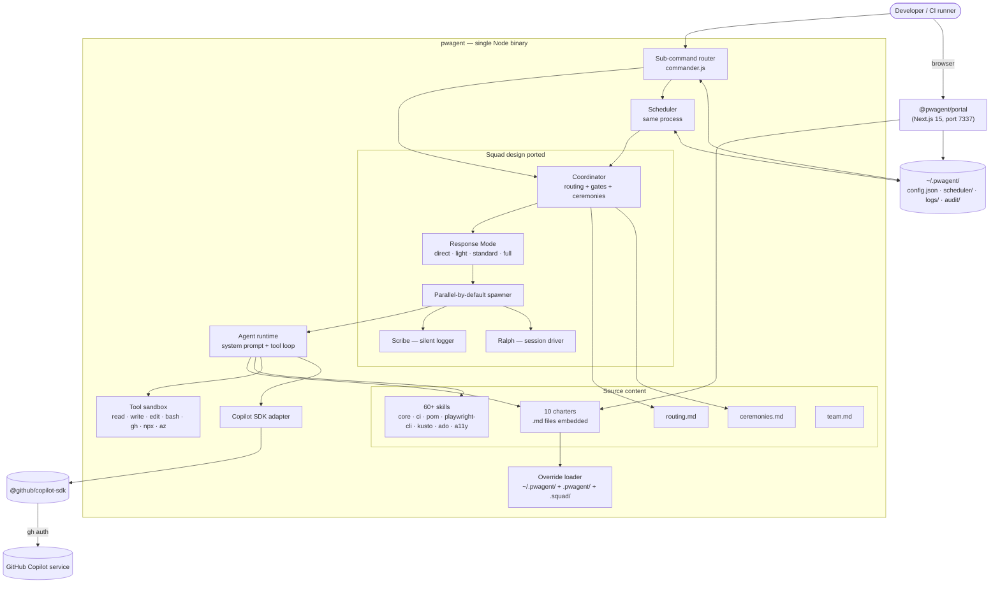
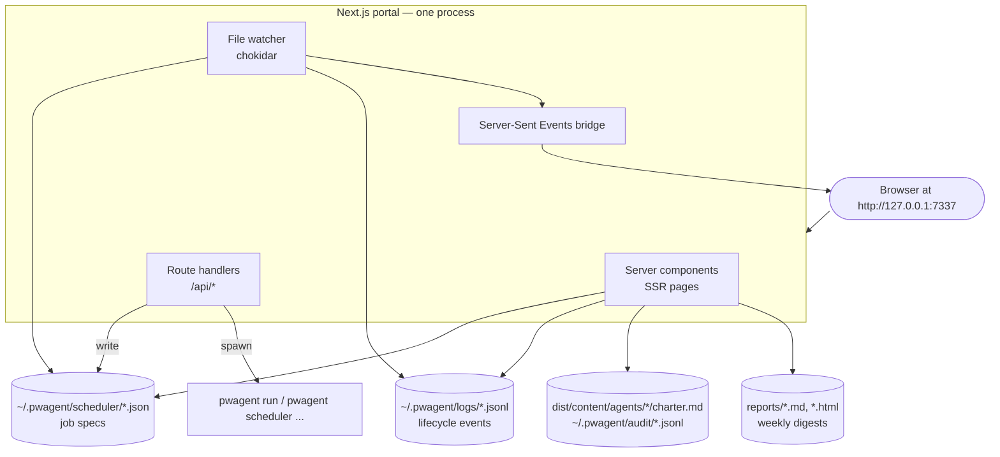
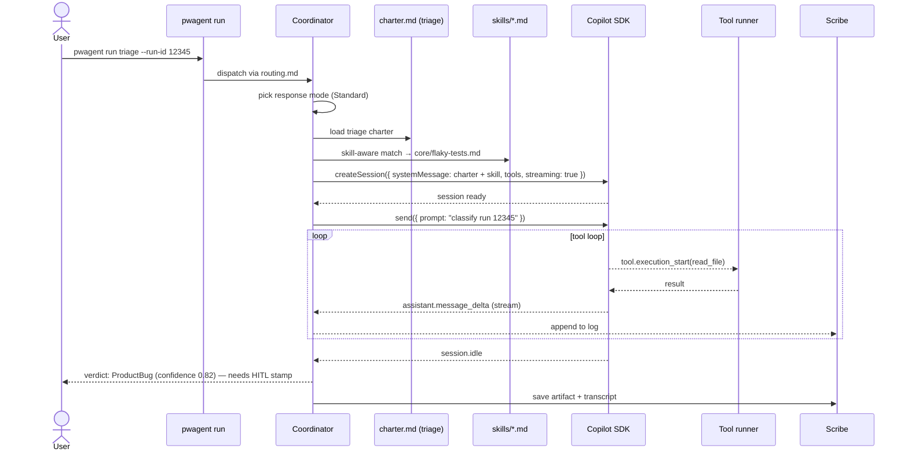
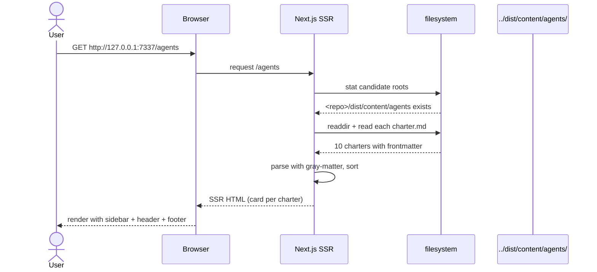

```
  ██████╗  ██╗    ██╗  █████╗   ██████╗ ███████╗███╗   ██╗████████╗
  ██╔══██╗ ██║    ██║ ██╔══██╗ ██╔════╝ ██╔════╝████╗  ██║╚══██╔══╝
  ██████╔╝ ██║ █╗ ██║ ███████║ ██║  ███╗█████╗  ██╔██╗ ██║   ██║
  ██╔═══╝  ██║███╗██║ ██╔══██║ ██║   ██║██╔══╝  ██║╚██╗██║   ██║
  ██║      ╚███╔███╔╝ ██║  ██║ ╚██████╔╝███████╗██║ ╚████║   ██║
  ╚═╝       ╚══╝╚══╝  ╚═╝  ╚═╝  ╚═════╝ ╚══════╝╚═╝  ╚═══╝   ╚═╝

  Multi-agent Playwright testing — Squad design, GitHub Copilot SDK runtime.
  cli (engine) · portal (dashboard) · scheduler (in-process)

─────────────────────────────────────────────────────────────────
```

# pwagent

**`pwagent`** = **`pw`** + **`agent`** — short for **"playwright agent"**, mirroring the `pw` two-letter prefix used by Playwright's own packages.

Standalone CLI for multi-agent Playwright testing. **Squad design, self-contained runtime, GitHub Copilot SDK.**

[](https://nodejs.org/)
[](https://www.typescriptlang.org/)
[](https://www.npmjs.com/package/@github/copilot-sdk)
[](https://nextjs.org/)
[](https://tailwindcss.com/)
[](https://ui.shadcn.com/)
[](https://playwright.dev/)
[](https://vitest.dev/)
[](https://github.com/bradygaster/squad)
[](#status--roadmap)
[](https://docs.npmjs.com/cli/v10/using-npm/workspaces)
[](LICENSE)

> One install. One mental model. One config. Built like `playwright` and `gh copilot` — a single binary that carries its own agent runtime, scheduler, and provider client.

---

## Table of contents

- [What it is](#what-it-is)
- [Where pwagent runs (IDE / CLI compatibility)](#where-pwagent-runs-ide--cli-compatibility)
- [Usage guide with example prompts](USAGE.md)
- [Documentation site](#documentation-site)
- [Design rationale](#design-rationale)
- [Architecture](#architecture)
- [What Squad is (brief primer)](#what-squad-is-brief-primer)
- [Squad principles (adopted)](#squad-principles-adopted)
- [What we deliberately don't adopt](#what-we-deliberately-dont-adopt)
- [Technology stack](#technology-stack)
- [Setup](#setup)
- [Usage](#usage)
- [Portal](#portal)
- [Scheduler](#scheduler)
- [Repository layout](#repository-layout)
- [Sequence diagrams](#sequence-diagrams)
- [Status & roadmap](#status--roadmap)
- [Contributing](#contributing)
- [License](#license)

---

## What it is

`pwagent` is a **multi-agent system for Playwright testing**: triage failures, patch tests or product code, validate the fix, open the PR — all driven by Markdown charters that describe each specialist agent. It runs entirely on **GitHub Copilot via [`@github/copilot-sdk`](https://www.npmjs.com/package/@github/copilot-sdk)** — Microsoft-internal Copilot license powers the model calls; no external API keys.

It adopts every design pattern from [Brady Gaster's Squad](https://github.com/bradygaster/squad) (charters, routing, reviewer gates, ceremonies, parallel-by-default, Scribe + Ralph) but ships its **own runtime** — no Copilot CLI host process, no `squad.agent.md` token tax per session. The 74 KB upstream coordinator manifest is compiled into the binary. **Workspace overrides** read from `.pwagent/` first (our convention), falling back to `.squad/` (Squad-scaffolded) for full upstream interop.

The v0.3 simplified roster has **10 specialist agents**:

| Agent | What it does |
|---|---|
| **supervisor** | Top-level router — consults `routing.md` to pick the right specialist |
| **generate** | Author new Playwright tests for a scenario or coverage gap |
| **heal** | Patch a failing test or product bug (requires triage stamp first) |
| **plan** | Build a fix plan from `failures.json` or a scenario-gap report |
| **scenario** | Coverage analyzer — emit ScenarioGap rows |
| **report** | Weekly + ad-hoc reports (Markdown + HTML) |
| **validate** | Run a test twice via `npx playwright test` |
| **auth** | Auth-flow specialist (storage state, multi-role, login retries) |
| **triage** | Classify a failure: ProductBug / TestCodeBug / Environment / Inconclusive |
| **review** | HITL gate — operator stamps `[p]` / `[t]` / `[s]` / `[o]` |

The monorepo (root [`package.json`](package.json)) ships three independent packages under npm workspaces, plus a docs site:

| Package | Path | What it is |
|---|---|---|
| **`@pwagent/cli`** | `cli/` | The standalone CLI binary, agent runtime, scheduler |
| **`@pwagent/portal`** | `portal/` | Local Next.js dashboard (port 7337) — Tailwind + shadcn/ui |
| **`@pwagent/docs`** | `docs/` | End-to-end professional documentation (port 7338) — Nextra + Next.js |
| **scheduler** (in-process) | `cli/src/scheduler/` | Tick loop, locks, JSONL events, hot-reload |

Removing any layer leaves the others working — **three independent layers** plus a static docs site.

---

## Where pwagent runs (IDE / CLI compatibility)

`pwagent` is a **plain Node CLI**. Anything that can run a binary can run `pwagent` — there is no IDE plugin, no VS Code extension, no Copilot extension to install. **We keep it that way to avoid lock-in.**

| Surface | Status | How it works |
|---|---|---|
| **Standalone terminal** (PowerShell, bash, zsh, Windows Terminal) | ✓ first-class | `pwagent <args>` from any shell |
| **Claude Code CLI** | ✓ shell-out | Run `pwagent run triage --run-id X` from inside a Claude Code session — Claude's bash tool invokes it like any other CLI. pwagent does not depend on Claude Code |
| **Claude Code VS Code extension** | ✓ shell-out | Extension's integrated terminal runs `pwagent` directly. No special integration needed |
| **GitHub Copilot CLI** | ✓ shell-out | Copilot CLI's shell can invoke `pwagent`. Independent: pwagent uses `@github/copilot-sdk` (the SDK, not the CLI) for its own model calls — the two coexist without conflict |
| **GitHub Copilot VS Code extension** | ✓ shell-out | The extension's integrated terminal runs `pwagent` like any other binary. The extension itself doesn't drive pwagent — they're peers, not nested |
| **VS Code (any)** | ✓ tasks + terminal | Add `pwagent run` commands to `.vscode/tasks.json`, or invoke from the integrated terminal |
| **Cursor, Windsurf, JetBrains, other forks** | ✓ shell-out | Same as VS Code — pwagent is a regular CLI |
| **CI runners (GitHub Actions, ADO Pipelines)** | ✓ first-class | `pwagent` runs on any CI runner with Node 22 + `gh auth` configured. Use `GH_TOKEN` env var for non-interactive auth |

A **thin VS Code chat wrapper** is on the roadmap (a ~30-line shim that surfaces `pwagent` inside the chat panel) but is not part of v0.4. The CLI works fully without it.

---

## Documentation site

`@pwagent/docs` is a Nextra-powered static documentation site that lives in the `docs/` workspace and runs on **port 7338** (the portal is 7337, so docs sits right next to it).

```powershell
npm run dev:docs           # http://127.0.0.1:7338  (live reload)
npm run build:docs         # static build
npm run start:docs         # production server on 7338
```

The site covers **54 routes** end-to-end:

- **Home** (`/`), **Getting Started** (5 pages), **Architecture** (7 pages with Mermaid sequence diagrams)
- **Agents** (one page per specialist — supervisor, triage, heal, generate, plan, scenario, report, validate, auth, review)
- **Skills**, **CLI Reference**, **Portal** (6 pages — routes, Server Actions, SSE, auth, read-only mode, help link)
- **Scheduler**, **Configuration**, **Squad Design**
- **Operations** (5 pages — audit log, HITL review, ralph, service installer, troubleshooting)
- **Contributing**, **FAQ**

The portal links to the docs from three places:
1. **Sidebar** — a `Help` entry at the bottom (above the Collapse button) with an external-link indicator
2. **Header** — a `?` icon next to the bell/search buttons
3. **Footer** — the `docs` link points at `127.0.0.1:7338` (can be overridden via `config.portal.helpUrl` for production deployments)

All three resolve the docs URL **dynamically** from `window.location.hostname:7338`, so the link works whether you access the portal at `localhost`, `127.0.0.1`, or a network IP via `--bind-all`.

---

## Design rationale

"Make `pwagent` work like `playwright`." Install it once with `npm i -g @pwagent/cli`. It carries its own agent runtime, its own scheduler, its own model client. It does **not** depend on `gh copilot`, does **not** require VS Code, does **not** install a Copilot plugin. If a workspace has a `.pwagent/` (or `.squad/`) directory, `pwagent` picks up the charters and skills there as overrides — otherwise it uses the ones baked into the binary. The same binary runs interactively, runs unattended via its built-in scheduler, and (optionally) backs a 30-line VS Code chat wrapper.

The team flagged complexity twice during design. This shape cuts to:

- **1 binary** the user installs.
- **1 state directory** (`~/.pwagent/`).
- **1 config file**.
- **1 update path** (`npm update -g @pwagent/cli`).

Everything else — chat surface, Copilot plugin shim, GitHub Actions integration — becomes a thin wrapper over the binary, written *only if* a user actually asks for it.

### Reference tools the design copies

| Reference tool | What we copy |
|---|---|
| `playwright` | One binary; sub-commands (`test`, `codegen`, `show-trace`); built-in runner; works anywhere Node runs; per-project config picked up if present |
| `gh copilot` | One binary; talks to a model gateway; single `gh auth` step |
| `gh` itself | Extensions via `gh extension install`; consistent UX across sub-commands |
| `npx <pkg>` | Zero-install on-the-fly invocation as a fallback |

### What we win

- **All eleven Squad design benefits retained** (see [Squad principles (adopted)](#squad-principles-adopted)): charter-as-code, routing, reviewer gates, ceremonies, parallel-by-default spawn, response-mode selection, skill-aware spawn, append-only memory, casting, GitHub integration, Scribe + Ralph. Same filesystem layout, same mental model — different runtime.
- **One install, one mental model, one update path.**
- **Works on any machine the team uses** — corporate laptops, CI runners, air-gapped boxes, locked-down VDIs — provided `gh auth` is configured.
- **Scheduler is not a separate thing.** Same process, same config, same logs.
- **VS Code becomes optional.** No extension build required for v1.
- **Per-agent model choice.** Pin Opus 4.7 for triage, Haiku 4.5 for the learner — declared in the charter's `## Model` block, overridable per-invocation with `--model`.
- **No 74 KB coordinator manifest tax per session.** The coordinator is compiled into the binary, not re-prompted on every turn.
- **Removable.** `npm uninstall -g @pwagent/cli && rm -rf ~/.pwagent/` — gone. No orphaned services, no extension leftovers, no Copilot plugin still registered.

---

## Architecture

### High-level components



### Hard rules

- **Squad design, our runtime.** We adopt the eleven Squad benefits verbatim as filesystem conventions and runtime behaviours. We do **not** load the upstream Squad coordinator manifest at run time — the coordinator logic is a module inside `pwagent`.
- **Embedded by default.** All 10 charters and 60+ skill guides ship inside the binary. Works zero-config in any directory.
- **Workspace overrides win.** If `cwd/.pwagent/agents/triage/charter.md` exists, it overrides the embedded triage charter for that invocation. Source-controlled customisation without forking the binary.
- **Scheduler is a sub-command**, not a separate daemon. Same logs, same config, same process.
- **Three independent layers.** CLI, portal, and scheduler each function alone; removing any one leaves the others working.

### Charter / skill resolution order

```
1. embedded   →  <dist>/content/agents/<name>/charter.md          (shipped in the binary)
2. user       →  ~/.pwagent/agents/<name>.md                       (per-machine override)
3. workspace  →  <cwd>/.squad/agents/<name>/charter.md             (Squad-scaffolded — fallback)
4. workspace  →  <cwd>/.pwagent/agents/<name>/charter.md           (preferred convention — wins)
```

Same chain for skills under `*/skills/`. Loaders are in [cli/src/charters/loader.ts](cli/src/charters/loader.ts) and [cli/src/skills/loader.ts](cli/src/skills/loader.ts).

---

## What Squad is (brief primer)

Skip this section if you already know Squad. Otherwise: **Squad** is a multi-agent orchestration framework by Brady Gaster ([github.com/bradygaster/squad](https://github.com/bradygaster/squad)) that runs **inside GitHub Copilot CLI**. It turns a single Copilot session into a team of specialised AI agents that live as Markdown files in your repository.

In one sentence:

> Squad is a *coordinator prompt* + a *filesystem convention* (`.squad/`) + a *CLI* (`@bradygaster/squad-cli`) that lets you describe an AI team in version-controlled Markdown and then route work to its members through a Copilot CLI session.

### What Squad is, mechanically

| Layer | What it is | Where it lives |
|---|---|---|
| **Coordinator prompt** | One large agent manifest (`squad.agent.md`) that Copilot CLI loads as the "Squad" agent | `.github/agents/squad.agent.md` |
| **Filesystem state** | A `.squad/` directory of Markdown / JSON files describing the team, routing, decisions, ceremonies, casting, skills | `.squad/` |
| **Per-agent charters** | One Markdown file per agent describing identity, responsibilities, boundaries | `.squad/agents/<name>/charter.md` |
| **CLI** | `@bradygaster/squad-cli` for init, watch, and migration commands | npm global install |
| **GitHub workflows** | Optional Actions that mirror `.squad/team.md` into labels and auto-triage issues | `.github/workflows/squad-*.yml` |

### What Squad is NOT

- **NOT a scheduler.** Squad has no cron, no daemon, no in-process timer.
- **NOT a code framework.** There is no SDK, no API, no library to import. The "code" is Markdown.
- **NOT a hosted service.** Everything runs locally inside your Copilot CLI session.
- **NOT a runtime by itself.** Without Copilot CLI it's inert documentation.

`pwagent` keeps Squad's design and Markdown file formats but replaces Copilot CLI with its own embedded runtime. That is what makes it independently installable and CI/air-gap-capable on day one.

---

## Squad principles (adopted)

`pwagent` is **Squad's design with our runtime**. Each of the eleven Squad benefits ports into the binary as a first-class module or filesystem convention.

| # | Squad benefit | How pwagent provides it |
|---|---|---|
| 1 | **Charter-as-code** — one Markdown file per agent with stable Identity / Responsibilities / Boundaries / Tools / Model sections | Same format, same paths. `.pwagent/agents/<name>/charter.md` (or `.squad/...`) either embedded or overridden. `pwagent agents show <name>` renders one. |
| 2 | **Routing instead of prompt-stuffing** | `~/.pwagent/routing.md` (or workspace) — coordinator consults the table on every user utterance. |
| 3 | **Reviewer gates** — declarative QA | A `gates:` table in `routing.md` says which artefacts require which reviewer. Runtime refuses to spawn `heal` without a triage stamp. |
| 4 | **Persistent identity via casting** | `~/.pwagent/casting/registry.json` — opt-in. Off by default (keeps admin-tool searchability). |
| 5 | **Append-only memory** with `merge=union` | Same `.gitattributes` snippet. `decisions.md`, `agents/*/history.md`, `log/`, `orchestration-log/` all concat on merge. |
| 6 | **Ceremonies** — auto-run agendas | `ceremonies.md` declares them; the coordinator runs the agenda when the condition matches. |
| 7 | **Parallel-by-default execution** | Coordinator spawner takes independent sub-tasks and dispatches them concurrently via `Promise.all` against the Copilot SDK. |
| 8 | **Response Mode Selection** — Direct / Lightweight / Standard / Full | `pwagent run --mode=light` (or coordinator-chosen). Direct skips spawn; Full runs ceremonies + Scribe. |
| 9 | **Skills with confidence lifecycle** | Skill-aware spawn injects `read .pwagent/skills/<x>.md before starting` into the spawn prompt. Confidence in `~/.pwagent/skills/<name>/.confidence`. |
| 10 | **GitHub integration** | The four `.github/workflows/squad-*.yml` workflows from upstream Squad still parse `## Members` literally from `team.md`. |
| 11 | **Free Scribe + Ralph** | Built into the binary. Scribe writes to `.pwagent/log/`. Ralph is `pwagent ralph go / status / stop`. |

### Response Mode Selection (cost / latency tuning)

For every user turn the coordinator picks a mode:

| Mode | When | Target latency | Spawn |
|---|---|---|---|
| **Direct** | Status checks, factual answers from context | ~2-3s | None |
| **Lightweight** | Single-file edits, small fixes | ~8-12s | 1 agent, minimal prompt |
| **Standard** | Normal tasks, full ceremony | ~25-35s | 1 agent, full context |
| **Full** | Multi-agent, "Team" requests | ~40-60s | Parallel fan-out + Scribe |

### Three layers of "keep working"

Squad describes three ways an agent team keeps moving without a user typing. `pwagent` ships equivalents:

| Layer | Squad source | pwagent equivalent |
|---|---|---|
| **L1 — In-session loop** | Ralph built into the coordinator manifest | `pwagent ralph go / status / stop` |
| **L2 — Local watchdog** | `npx github:bradygaster/squad watch` | `pwagent scheduler start` (see [Scheduler](#scheduler)) |
| **L3 — Cloud heartbeat** | `.github/workflows/squad-heartbeat.yml` | Identical workflow, calls `pwagent` instead of opening a Copilot session |

---

## What we deliberately don't adopt

| Squad piece | Why we drop it |
|---|---|
| The 74 KB upstream `squad.agent.md` coordinator manifest | Embedded as compiled logic inside the binary. No per-turn token cost. Tracked as a reference only — never run as a prompt. |
| `@bradygaster/squad-cli` as a runtime dependency | `pwagent init` replaces its init/watch/migration commands. We still recognise the `.squad/` filesystem format Squad produces so workspaces scaffolded by `npx @bradygaster/squad-cli init` work without modification. |
| Squad's `@copilot` coding-agent roster member | Out of scope for v1. If needed later, a charter like any other. |

---

## Technology stack

| Layer | Choice | Why |
|---|---|---|
| **Runtime** | Node 22+ | Required by `@github/copilot-sdk` (uses built-in `node:sqlite`) |
| **Language** | TypeScript 5.7, strict | Catches charter/config drift at build time |
| **CLI framework** | [commander](https://github.com/tj/commander.js) | Stable, low-deps, handles sub-commands well |
| **Provider SDK** | [`@github/copilot-sdk`](https://www.npmjs.com/package/@github/copilot-sdk) v0.3 | Microsoft-internal Copilot license; no API keys |
| **Validation** | [zod](https://zod.dev/) | Config schema + safe `set` paths |
| **Frontmatter** | [gray-matter](https://github.com/jonschlinkert/gray-matter) | Reads charter `name` / `description` headers |
| **Process spawn** | [execa](https://github.com/sindresorhus/execa) | Used for prereq detection + install flow |
| **Prompts** | [prompts](https://github.com/terkelg/prompts) | `pwagent init` interactive flow |
| **Colours** | [picocolors](https://github.com/alexeyraspopov/picocolors) | Tiny, no deps |
| **Tests** | [Vitest](https://vitest.dev/) + isolated tmp `PWAGENT_HOME` | Fast forks |
| **Portal framework** | Next.js 15 App Router + React 19 | SSR + RSC for streaming |
| **Portal UI** | [shadcn/ui](https://ui.shadcn.com/) on Tailwind 3.4 | Hand-written components in `portal/components/ui/` |
| **Icons** | [lucide-react](https://lucide.dev/) | Consistent with shadcn ecosystem |

---

## Setup

### 1. Install via npm workspaces (single command for CLI + portal)

```powershell
cd D:\gith\pwagent
npm install            # installs both cli/ and portal/ deps in one shot
npm run build          # builds both packages
npm link --workspace cli   # makes `pwagent` globally available from this checkout
```

The root [package.json](package.json) declares `workspaces: ["cli", "portal"]`, so a single `npm install` at the root hoists shared deps and links the two packages. Per-package commands:

```powershell
npm run build:cli      # cli only
npm run build:portal   # portal only
npm test               # cli vitest suite
npm run dev:portal     # portal in dev mode at http://127.0.0.1:7337
```

### 2. Copy the sample config

```powershell
copy pwagent.config.example.json "$env:USERPROFILE\.pwagent\config.json"
notepad "$env:USERPROFILE\.pwagent\config.json"   # edit your ADO org + project
```

User state lives at `~/.pwagent/` (Windows: `C:\Users\<you>\.pwagent\`).

### 3. Verify prerequisites and install missing ones

```powershell
pwagent prereqs                     # report only
pwagent prereqs --install           # install missing recommended (interactive)
pwagent prereqs --install --yes     # non-interactive — accept all
```

`pwagent` is a coordinator — most heavy lifting happens through other CLIs we shell out to. The full prereq matrix:

| Tier | Prereq | Why pwagent needs it | Auto-install |
|---|---|---|---|
| required | `node` (≥22) | Runtime for the binary itself | manual (suggestion: `nvm install 22` / `winget install OpenJS.NodeJS.LTS`) |
| required | `git` | Repo ops, patches, branching, PR prep | winget / brew / apt / dnf / pacman |
| required | `gh` | Copilot SDK auth. Also: PR creation, Issues, repo discovery | winget / brew / apt |
| required | **`gh auth (logged in)`** | Copilot subscription must be active | runs `gh auth login --web` |
| required | `az` | ADO triage + PR creation; Kusto auth | winget / brew / apt |
| required | `az pipelines` extension | Pipeline run details for triage | `az extension add --name azure-devops` |
| required | `@axe-core/cli` | Accessibility scans (a11y verifier) | `npm i -g @axe-core/cli` |
| required | kusto CLI | `kusto` skill, flake history | manual ([aka.ms/kustofree](https://aka.ms/kustofree)) |
| recommended | `@playwright/test` | validator / fixer / author | `npm i -g @playwright/test` |
| recommended | Playwright browsers | headless Chromium / Firefox / WebKit | `npx playwright install` |
| optional | VS Code | Only needed for the `@pwagent` chat wrapper | winget / brew |

Package-manager detection:

| Platform | Detected by | Falls back to |
|---|---|---|
| Windows | `winget --version` → `winget install` | manual link |
| macOS | `brew --version` → `brew install` | manual link |
| Debian/Ubuntu | `apt -v` + sudo available → `sudo apt install` | manual link |
| Fedora/RHEL | `dnf --version` + sudo available → `sudo dnf install` | manual link |
| Arch | `pacman --version` + sudo available → `sudo pacman -S` | manual link |
| Node-globals | always `npm install -g` | n/a |
| gh extensions | always `gh extension install` | n/a |

Safety rules:

- **No silent installs.** Default is `pwagent prereqs` (report only). `--install` requires the flag.
- **No sudo without explicit consent.** Linux installs show the exact `sudo` line and wait for confirmation.
- **Network-only when needed.** Report mode makes no network calls — only `which` / `--version` probes.

### 4. Authenticate with GitHub

```powershell
pwagent login           # wraps `gh auth login --web`
pwagent whoami          # verify Copilot is reachable
```

### 5. Initialise config

```powershell
pwagent init            # interactive: model, ADO org/project, default repo
pwagent doctor          # composed prereq + config + provider + features view
```

Expected `pwagent doctor` output:

```
binary version    0.1.0
charters          10 (embedded)
skills            64 (embedded)
config            C:\Users\<you>\.pwagent\config.json    OK
provider          github-copilot-sdk (claude-sonnet-4.5)
copilot probe     [✓] Copilot SDK reachable (812ms)
prerequisites
  required        node (≥22) ✓ · git ✓ · gh ✓ · gh auth (logged in) ✓ · az ✓ · az pipelines ext ✓ · @axe-core/cli ✓ · kusto CLI ✓
  recommended     playwright ✓ · playwright browsers ✓
  optional        VS Code ✓
features
  test execution  available
  ADO triage      available
  ADO PRs         available
  GitHub PRs      available
  GitHub Issues   available
  a11y verify     available
  flake finder    available
  chat wrapper    available
scheduler         not running    (run: pwagent scheduler start)
Ready.
```

`pwagent doctor --fix` is an alias for `pwagent prereqs --install --yes` followed by re-verification.

### 6. (Optional) Run the portal

```powershell
cd portal
npm install
npm run dev             # http://127.0.0.1:7337
```

---

## Usage

### Daily driver — `pwagent` drops you into chat

```bash
pwagent                              # opens chat (same as `pwagent chat`)
```

That's the whole workflow. Type free text or slash commands; the supervisor routes natural language to the right specialist automatically, and `/<agent> <args>` invokes any specialist directly. Sessions auto-save to `~/.pwagent/sessions/<id>.jsonl`.

See the dedicated [Interactive chat — `pwagent chat`](#interactive-chat--pwagent-chat) section below for the slash-command reference and screenshots.

### Bootstrap (one time)

```bash
pwagent init [--yes]
pwagent login                       # gh auth login --web (Copilot SDK)
pwagent doctor                      # verify prereqs + auth + SDK reachability
pwagent prereqs --install --yes     # install missing prereqs (gh, az, axe, kusto)
```

These all also work as slash commands inside chat: `/init`, `/login`, `/doctor`, `/doctor --fix`.

### Inspection

```bash
pwagent agents list
pwagent agents show <name>           # e.g. triage, fix, validate, supervisor
pwagent agents add <path>
pwagent skills list [--pack core|ci|pom|playwright-cli|kusto|ado|a11y]
pwagent skills show <pack>/<name>    # e.g. core/locators, ado
```

Inside chat: `/agents`, `/skills`, `/help <agent>`.

### Config + model

```bash
pwagent config view | get <path> | set <path> <val> | path
pwagent model list | show | set <id> [--agent <agent>] | reset
```

Inside chat: `/model <id>`.

### CI / unattended — `pwagent run` (not the daily-driver path)

`pwagent run <agent>` is kept for **CI runners and scheduled jobs** — same coordinator + SDK as chat, but headless. Use it from GitHub Actions, ADO Pipelines, the scheduler in `~/.pwagent/scheduler/`, or any non-interactive context.

```bash
# CI mode — fix everything red without a human in the loop
pwagent run fix --orchestrate --ado-pipeline 23878 --auto-stamp --json

# Scheduler job spec
{
  "command": "pwagent run fix --orchestrate --ado-pipeline 23878 --max-failures 5 --auto-stamp",
  "schedule": { "type": "cron", "cron": "*/15 9-17 * * 1-5" }
}
```

Full flags:

```bash
pwagent run <agent> [prompt...] [--model <id>] [--mode direct|light|standard|full] \
                                 [--cwd <path>] [--dry-run] [--json] [--debug] \
                                 [--connect-timeout-s <n>] [--idle-timeout-s <n>]
```

For day-to-day human use, **just type `pwagent`** and use slash commands.

### Other entry points

```bash
pwagent review                       # interactive HITL stamp loop (also /review in chat)
pwagent ralph go | status | stop     # in-session driver (Squad-style; legacy)

# scheduler — in-process, hot-reload, JSONL events
pwagent scheduler start [--daemon]
pwagent scheduler stop
pwagent scheduler list
pwagent scheduler status [<id>] [-n <limit>]
pwagent scheduler dry-run <id> [--execute]
pwagent job add <path>
pwagent job enable <id> | disable <id>
pwagent job logs <id> [-n <limit>]

# portal — local Next.js dashboard
pwagent portal start [--dev] [--port <n>] [--read-only] [--bind-all]
pwagent portal status [--port <n>]

# audit
pwagent audit tail [-n <limit>]
pwagent audit export [--since 7d] [--type <t>] [--agent <a>] [--format jsonl|json|table] [-o <file>]

# service install (platform-native unattended scheduler)
pwagent service install | uninstall | status
```

### Agents and their arguments

pwagent ships **13 specialist agents**. Multi-purpose agents specialize via flags (`fix --scope test|product`, `validate --test|--a11y`, `discover --watch`, etc.) — fewer charters, sharper composition.

| Agent | Purpose | Key arguments |
|---|---|---|
| **supervisor** | Top-level router (default when no agent named) | (none — invoked by `pwagent run "<prompt>"` without an agent) |
| **discover** | Find failing tests; optional CI daemon | `--source local\|ado\|github\|kusto` · `--pipeline <id>` · `--build <id>` · `--run-id <id>` · `--window 7d` · `--watch` · `--poll-seconds 300` · `--max-dispatch 10` · `--status` · `--stop` |
| **triage** | Classify failures (ProductBug / TestCodeBug / Environment / Inconclusive) | `--run-id <id>` · `--artifact <path>` · `--example` (canned fixture) |
| **analyze** | Read-only analyzer; three orthogonal modes | `--scenarios [--path <dir>] [--min-coverage N] [--fail-on-critical]` · `--flakes --pipeline <id> [--top N] [--window <dur>] [--format json\|csv]` · `--test-quality --files <glob> [--severity-min Low\|Medium\|High\|Critical] [--file-bug] [--pr-comment <pr-id>]` |
| **review** | HITL stamp gate; pause until human approves | (interactive) · `--list` · `--batch < stamps.txt` |
| **plan** | Build an ordered fix plan | `--failures <path>` · `--from-scenario` · `--from-triage <id>` |
| **fix** | Patcher (atomic) + orchestrator | **Scope (atomic):** `--scope test\|product\|auto` · `--plan <path> --test <name>` · `--from-triage <id>` · `--bug AB#<id>` · `--diff-only` · `--skip-gate` (audited). **Orchestrate (full chain):** `--orchestrate --ado-pipeline <id>` · `--orchestrate --ado-build <id>` · `--orchestrate --bug AB#<id>` · `--orchestrate --bugs --top N --area <path>` · `--max-failures 25` · `--auto-stamp` (audited) · `--bundle-pr` |
| **validate** | Run something twice; report delta | `--test <file> [--repeat N] [--grep <pat>] [--project <name>]` · `--a11y --bug AB#<id> [--url <url>]` |
| **publish** | Open PR via REST (ADO) or `gh` (GitHub) | `--branch <name>` · `--target <branch>` · `--bug AB#<id>` · `--results <path>` · `--draft` · `--reviewer @user` · `--allow-large-pr` |
| **author** | New-test writer with 7-day probation | `--scenario "<text>"` · `--from-gap ScenarioGap-<id>` · `--coverage-gap <path>` · `--cwd <path>` |
| **auth** | Auth-flow specialist | `--add-role <name>` · `--refresh-state <role>` · `--diagnose --trace <path>` · free-text |
| **record** | Canonical-state writer (two kinds) | **Matrix:** `--kind matrix --op import\|sync\|link\|query\|decide\|stamp\|gap` plus per-op flags (`--bug-ids`, `--tests <glob>`, `--bug` + `--test`, `--verdict`, `--confidence`, `--rationale`, `--stamp p\|t\|s\|o`, `--operator`, `--gap`, `--severity`). **Patterns:** `--kind patterns --from <fix-results.json>` |
| **report** | Weekly + ad-hoc reports | `--window 7d\|30d` · `--since <date> --until <date>` · `--kind weekly\|flake-rank\|triage\|hitl-audit\|scenario-coverage\|test-health\|self-health` · `--commit` (commits to repo) |

**Global flags** that work on every agent invocation:

| Flag | Meaning |
|---|---|
| `--model <id>` | Override the charter's preferred model for this call |
| `--mode direct\|light\|standard\|full` | Force a response mode (skip the coordinator's inference) |
| `--cwd <path>` | Resolve workspace overrides from this directory |
| `--dry-run` | Resolve charter + skills + tools, print system message, **do not** call the SDK |
| `--json` | Stream JSON events to stdout instead of markdown |
| `--skills <a,b,c>` | Replace skill-aware inference with this explicit set |
| `--tool-timeout-s <n>` | Per-tool timeout (default 120) |
| `--idle-timeout-s <n>` | SDK session idle timeout (default per mode) |
| `--skip-gate` | Bypass reviewer gates (recorded in audit as `gateSkipped: true`) |

#### The canonical chain — `fix --orchestrate`

```
discover (--source ado|github|local|kusto)
  → triage (parallel fan-out, one per failure)
    → review (HITL serial gate; skip with --auto-stamp)
      → plan
        → fix --scope <test|product>  (parallel fan-out, one per plan entry)
          → validate --test            (twice — gate two greens)
            → publish                  (one PR per group)
              → record --kind matrix   (link bug ↔ test ↔ verdict ↔ stamp)
```

`validate --a11y` runs **alongside** `validate --test` when accessibility is in scope. `record --kind patterns` runs **after** the PR merges. `report` runs **on a schedule** and reads the matrix + audit log.

#### Quick examples per agent

```bash
# Full chain — fix everything red in an ADO pipeline
pwagent run fix --orchestrate --ado-pipeline 23878 --auto-stamp

# Daemon — poll ADO + GitHub Actions, dispatch triage on new failures
pwagent run discover --watch --poll-seconds 300

# One-shot discover from Kusto
pwagent run discover --source kusto --pipeline 23878 --window 7d

# Atomic test-side fix from a stamped plan
pwagent run fix --scope test --plan ./fix-plan.json --test "login should redirect"

# Run a test twice
pwagent run validate --test tests/login.spec.ts --repeat 2

# axe-core before/after delta on an ADO bug
pwagent run validate --a11y --bug AB#54321

# Grade test code quality
pwagent run analyze --test-quality --files "tests/**/*.spec.ts" --severity-min High

# Top-10 flakes via Kusto
pwagent run analyze --flakes --pipeline 23878 --top 10 --window 30d

# Author a new test from a free-text scenario
pwagent run author --scenario "logged-in user applies a coupon and removes it"

# Import bugs into the traceability matrix
pwagent run record --kind matrix --op import --source ado --bug-ids 12345,12346

# Extract reusable patterns from a verified fix
pwagent run record --kind patterns --from ./fix-results.json
```

Full examples and end-to-end workflows live in [USAGE.md](USAGE.md).

### Interactive chat — `pwagent chat`

Type `pwagent` (or `pwagent chat`) to open the chat REPL. Visual style matches GitHub Copilot CLI: pink dots for agent narration, `✔` for completions, dim sub-lines for tool results, `›` prompt, and a status bar below the env line.

```bash
pwagent                                   # same as `pwagent chat`
pwagent chat                              # explicit form
pwagent chat --agent fix --mode direct    # pin to a specific agent + mode
pwagent chat --resume <session-id>        # continue a prior session (replays user turns)
pwagent chat --list                       # show saved sessions
```

**Autonomous routing.** Inside chat, the default active agent is the **supervisor**. The supervisor has a `dispatch_to_agent` tool — when you type free text, it picks the right specialist and runs it for you without asking permission. Example:

```
› fix everything red in pipeline 23878

● dispatch_to_agent  fix
   args  --orchestrate --ado-pipeline 23878
   model claude-sonnet-4.5

[fix runs its full chain: discover → triage → review → plan → fix → validate → publish]

✔ done · 73.2s · 1 tool call
```

**Direct slash invocation.** To bypass the supervisor and call a specialist immediately, prefix with the agent name:

```
› /fix --orchestrate --ado-pipeline 23878
› /triage --run-id 89211
› /analyze --flakes --pipeline 23878 --top 10
› /author --scenario "logged-in user applies a coupon and removes it"
```

**Slash command reference:**

| Group | Command | Effect |
|---|---|---|
| Setup | `/init` | Reconfigure provider, ADO, repos (interactive) |
| Setup | `/doctor [--fix] [--no-probe]` | Run health check; `--fix` installs missing prereqs |
| Setup | `/login` · `/logout` | gh auth flow |
| Agent | `/agents` | List the 13 specialist agents |
| Agent | `/agent <name>` | Switch active agent (rebuilds the chat session) |
| Agent | `/<name> [args]` | Direct one-shot call to that specialist (e.g. `/fix --orchestrate ...`) |
| Agent | `/model <id>` | Switch model for the active session |
| Agent | `/mode direct\|light\|standard\|full` | Change response mode |
| Agent | `/skills` | Show injected skills for the current agent |
| Session | `/session` · `/list-sessions` | Session id + path; list saved sessions |
| Session | `/cwd [path]` | Show or change tool working directory |
| Session | `/clear` | Clear screen and redraw banner |
| Session | `/exit` · `/quit` | Disconnect and exit |
| Session | `/help [agent]` | Slash-command list or one agent's invocation patterns |

**Startup probe.** Before the first `›` prompt, pwagent runs a fast (< 800 ms) health check:

```
✔ ready · v0.1.0 · claude-haiku-4.5 · D:\gith\CRM.Client.UnifiedClient [main]
```

If anything's amiss (no config, gh not logged in, prereq missing):

```
✗ doctor: 2 required prereqs missing (axe, kusto)
  Type /doctor for details · /init to reconfigure · /login if your token is stale
```

The status line above the prompt shows your cwd + git branch. The bar below shows version, slash-command hints, and the active agent + model.

**Sessions.** Every turn appends to `~/.pwagent/sessions/<id>.jsonl` (`user`, `assistant`, or `system` for errors). `--resume <id>` reads that file and replays your user turns silently into a fresh SDK session so the model rebuilds context. Saved sessions show up under `/list-sessions`.

### Coordinator runtime — what `pwagent run` actually does

- Resolves charter (workspace > user > embedded).
- Picks the model (charter `## Model` > `config.perAgent` > default).
- Filters tools from the charter's `## Tools` block.
- Injects skill references via keyword scoring (skill-aware spawn).
- Prepends the **master prompt** (`cli/src/content/master-prompt.md`) which encodes the cross-cutting Squad rules (reviewer gates, response modes, parallel-by-default, formatting, audit). Equivalent to upstream Squad's `squad.agent.md` but compiled into the binary.
- Calls `@github/copilot-sdk` (streaming, tool loop, idle timeout) and emits the result.

`pwagent run` without naming an agent (or via `pwagent ralph go`) spawns the **supervisor**, which consults `routing.md` to pick the right specialist. The `routing.md` parser lives at [cli/src/runtime/routingTable.ts](cli/src/runtime/routingTable.ts).

### Tool sandbox

| Tool | Notes |
|---|---|
| `read` | Read text files |
| `write` | Write text files (creates dirs) |
| `edit` | Exact-match string replacement |
| `bash` | Binary allowlist: `git`, `gh`, `az`, `npx`, `npm`, `node`, `pwsh`, `powershell`, `bash`, `sh`, `kusto.cli`, `axe`. Output capped at 200 KB; default timeout 120s. |
| `grep` | rg-aware (prefers ripgrep; falls back to grep) |

### Audit

JSONL append-only stream at `~/.pwagent/audit/events.jsonl`. Lifecycle vocab: `run.start`, `run.complete`, `run.error`, `tool.invoke`, `tool.error`, `review.stamp`, `scheduler.start`, `scheduler.stop`.

### Provider note — what we use, what we don't

`pwagent` runs **only** on `@github/copilot-sdk` (auth via `gh`). Charters declare model preferences (e.g. `claude-sonnet-4.5`, `claude-haiku-4-5`); per-invocation override is `--model`. No direct Anthropic / Bedrock / OpenAI SDK calls. No external API keys to manage.

---

## Portal

The portal is a separate Next.js process. It is **independent of the CLI** — kill the portal and the CLI + scheduler keep working; kill the scheduler and the portal still shows historical state.

### Why a separate portal

The CLI gives you imperative control. It is great for *doing* one thing. It is bad for *seeing*:

- Tailing five jobs at once
- Skimming yesterday's weekly report
- Editing schedules without hand-rolling JSON
- Cross-referencing a failed run to its triage verdict and the eventual PR

### Goals and non-goals

| Goal | Why |
|---|---|
| Single URL to see everything pwagent is doing | Operators want one place to look |
| Live log tail (per job, per agent) | Debugging unattended runs |
| Edit scheduler configs through a form (not JSON) | Lower barrier for non-engineers |
| Trigger one-off runs from a button | Faster than shelling out |
| Render reports (Markdown + HTML) inline | The weekly report is the audience-facing artifact |
| Audit-log viewer with filters | Compliance, "what ran last Tuesday" |

| Non-goal | Why not |
|---|---|
| Hosted multi-tenant SaaS | Local-only by design |
| Replace the CLI for power users | The CLI is faster for scripted work |
| Multi-user accounts / RBAC | One user per machine; auth only as a loopback guard |
| Live edit charters | Charters are source-controlled; UI is read-only for those |

### Architecture



Stack:

- **Next.js 15 App Router** — file-based routing, server components, streaming.
- **Tailwind CSS** + **shadcn/ui** for fast UI without designing from scratch.
- **Server Actions** for form writes (enable/disable jobs, edit schedules).
- **Server-Sent Events** (not WebSocket — simpler, fine for one-way log streaming).
- **No database.** All state is files on disk. SSR reads them on each request; SSE pushes deltas.

### Port allocation

Fixed default: **`http://127.0.0.1:7337`**. Memorable (`7337` ≈ "leet"), outside common dev ports (3000/3001/8080), bound to `127.0.0.1` only.

```bash
pwagent portal start                          # http://127.0.0.1:7337
pwagent portal start --port 3737              # alternative
PWAGENT_PORTAL_PORT=9999 pwagent portal start
```

### Routes

```
/                          Dashboard overview — active jobs, last 24h, HITL queue, latest report
/jobs                      Scheduler jobs table with enable/disable + new-job form
/jobs/[id]                 Job detail — spec viewer + live SSE event tail
/audit                     Audit log viewer with type / agent / time filters + export
/config                    Form editor for ~/.pwagent/config.json with diff preview + atomic save
/agents                    Charter browser (10 cards)
/skills                    Skill browser (60+ guides)
/playwright-cli            Playwright CLI command reference
```

### Auth + safety (v0.4)

- **Bearer auth** — per-install secret at `~/.pwagent/portal/secret` (chmod 600). HttpOnly cookie `pwagent_session`; every Server Action calls `requireWriteAuth()`.
- **Loopback enforcement** — [portal/middleware.ts](portal/middleware.ts) rejects non-loopback hosts + `X-Forwarded-*` headers. `--bind-all` flag opts out behind a trusted proxy.
- **`--read-only`** — `pwagent portal start --read-only` sets `PWAGENT_PORTAL_READ_ONLY=1`; Server Actions short-circuit; banner shown across pages.

---

## Scheduler

In-process, hot-reload, same binary. Job spec format:

```jsonc
{
  "id": "pwagent-monitor",
  "description": "Long-poll ADO + GH Actions for new failures",
  "enabled": true,
  "schedule": { "type": "interval", "minutes": 5 },
  "command": "pwagent monitor --once",
  "maxRunSeconds": 600,
  "retry": { "onExitCodes": [1, 124], "maxAttempts": 2, "backoffSeconds": 30 },
  "disableAfterConsecutiveFailures": 5,
  "logs":   { "path": "~/.pwagent/logs/scheduler/monitor.log" },
  "events": { "path": "~/.pwagent/logs/scheduler/pwagent-monitor.jsonl" }
}
```

Job files live in `~/.pwagent/scheduler/*.json`. Hot-reloaded on file change.

### Seed jobs (all `enabled: false` by default)

| Job id | Schedule | Purpose |
|---|---|---|
| `pwagent-monitor` | `interval: 5m` | Pull new failures from ADO + GH Actions; route to triage |
| `pwagent-coverage-nightly` | `daily: 02:00` | Scan src/ + tests/ for scenario gaps |
| `pwagent-report-weekly` | `weekly: Fri 17:00` | Generate weekly Markdown + HTML report |
| `pwagent-learner-nightly` | `daily: 03:00` | Extract fix patterns from green runs |

### Tick loop guarantees

- Per-job + per-process locks (`<id>.lock`).
- Atomic `state.json` writes.
- JSONL event stream (one file per job).
- Hot-reload via `fs.watch`.
- Retry with backoff; auto-disable on `disableAfterConsecutiveFailures`.

### Platform service installer

`pwagent service install` registers the scheduler with the OS service manager:

| Platform | Mechanism |
|---|---|
| Windows | Task Scheduler XML (`schtasks /Create`) |
| macOS | launchd plist (`launchctl load`) |
| Linux | systemd `--user` unit (`systemctl --user enable --now`) |

`pwagent service uninstall` removes it. `pwagent service status` reports state.

---

## Repository layout

```
pwagent/                          ← root: npm workspaces wrapper, private
├── package.json                  ← workspaces: ["cli", "portal"], top-level scripts
├── pwagent.config.example.json   ← sample config (copy to ~/.pwagent/config.json)
├── README.md
├── cli/                          ← @pwagent/cli (publishable)
│   ├── package.json              ← bin: pwagent
│   ├── tsconfig.json
│   ├── vitest.config.ts
│   ├── eslint.config.js
│   ├── scripts/copy-content.mjs  ← copies src/content → dist/content after tsc
│   ├── src/
│   │   ├── index.ts              ← CLI entrypoint (commander)
│   │   ├── cli/                  ← init, auth, doctor, prereqs, agents, skills, model, config, run, scheduler, portal, ralph, review, audit, service
│   │   ├── config/               ← zod schema + loader (atomic writes)
│   │   ├── charters/loader.ts    ← frontmatter parsing, override chain
│   │   ├── skills/loader.ts      ← pack/name + Squad <name>/SKILL.md shape
│   │   ├── prereqs/              ← matrix, detection, install flow
│   │   ├── scheduler/            ← spec, state, lock, events, dispatcher, loop, jobLoader
│   │   ├── runtime/              ← provider (Copilot SDK), coordinator, tools, routingTable
│   │   ├── audit/                ← JSONL writer + reader
│   │   ├── content/              ← embedded into the binary
│   │   │   ├── agents/           ← 10 charters: supervisor, generate, heal, plan, scenario, report, validate, auth, triage, review
│   │   │   ├── skills/
│   │   │   │   ├── core/         ← Playwright core guides (locators, assertions, fixtures, …)
│   │   │   │   ├── ci/           ← CI/CD guides
│   │   │   │   ├── pom/          ← Page Object Model
│   │   │   │   ├── playwright-cli/  ← codegen, traces, devices
│   │   │   │   ├── kusto/SKILL.md   ← Kusto queries (Squad-shape)
│   │   │   │   ├── ado/SKILL.md     ← ADO work items + PRs (Squad-shape)
│   │   │   │   └── a11y/SKILL.md    ← Accessibility (Squad-shape)
│   │   │   ├── master-prompt.md
│   │   │   ├── routing.md
│   │   │   ├── ceremonies.md
│   │   │   ├── team.md
│   │   │   └── config.example.json
│   │   └── utils/                ← paths, colours, files, prompts, banner
│   └── tests/                    ← vitest suite
└── portal/                       ← @pwagent/portal (private)
    ├── package.json
    ├── middleware.ts             ← loopback enforcement + X-Forwarded-* rejection
    ├── app/                      ← Next.js 15 App Router
    │   ├── api/                  ← /api/jobs, /api/jobs/[id], /api/events/jobs/[id] (SSE), /api/audit/export
    │   ├── jobs/                 ← jobs page + jobs/[id]/page.tsx (with live SSE tail)
    │   ├── audit/                ← audit log viewer
    │   ├── config/               ← form editor with diff preview
    │   └── …
    ├── components/
    │   ├── sidebar.tsx           ← SidebarProvider + Sidebar + SidebarInset
    │   ├── header.tsx            ← breadcrumb + actions
    │   ├── footer.tsx            ← version + scheduler status
    │   └── ui/                   ← shadcn/ui — button, card, separator, tooltip
    └── lib/                      ← jobs, paths, charter helpers, auth
```

### Workspace override directories

When a user runs pwagent inside a repo, charter / skill / routing overrides resolve in this order (later wins):

```
1. <dist>/content/                 (embedded — baked into the binary)
2. ~/.pwagent/                     (per-machine user override)
3. <cwd>/.squad/                   (Squad-scaffolded — for `npx squad init` workspaces)
4. <cwd>/.pwagent/                 (preferred workspace convention — wins)
```

This makes pwagent fully compatible with workspaces scaffolded by `npx @bradygaster/squad-cli init` while preferring our `.pwagent/` directory when users build their own.

---

## Sequence diagrams

### Bootstrap — first-time setup on a new machine

```mermaid
sequenceDiagram
    actor User
    participant Term as Terminal
    participant Bin as pwagent binary
    participant Gh as gh CLI
    participant SDK as @github/copilot-sdk

    User->>Term: pwagent prereqs --install
    Term->>Bin: detect each prereq
    Bin-->>Term: report (node ✓, git ✓, gh ✗, gh-auth ✗, ...)
    Bin->>Term: prompt: install gh via winget? [Y/n]
    User->>Term: y
    Bin->>Term: winget install GitHub.cli
    Term-->>Bin: ok

    User->>Term: pwagent login
    Bin->>Gh: gh auth login --web --scopes read:user
    Gh-->>User: open browser
    User->>Gh: complete OAuth
    Gh-->>Bin: token stored in gh keychain

    User->>Term: pwagent init
    Bin->>User: prompt model + ADO org/project
    User-->>Bin: claude-sonnet-4.5, contoso, Engineering
    Bin->>Bin: write ~/.pwagent/config.json (atomic)

    User->>Term: pwagent doctor
    Bin->>SDK: import; resolve auth via gh
    SDK-->>Bin: reachable
    Bin-->>User: Ready. (features matrix)
```

### Agent invocation



### Scheduler tick

```mermaid
sequenceDiagram
    participant Loop as pwagent scheduler<br/>(in-process)
    participant Store as state.json
    participant Lock as <id>.lock
    participant Disp as Dispatcher
    participant CLI as pwagent (same binary)
    participant Events as <id>.jsonl

    loop every 1s
        Loop->>Store: which jobs are due?
        alt one or more due
            Loop->>Lock: acquire <pwagent-monitor>.lock
            Loop->>Events: agent_start
            Loop->>Disp: spawn pwagent monitor --once
            Disp->>CLI: child_process.spawn
            CLI-->>Disp: exit code + stdout
            alt success
                Disp->>Events: agent_end (ok)
                Loop->>Store: update lastRunAt + nextDueAt
            else failure
                Disp->>Events: agent_error
                Loop->>Store: ++consecutiveFailures
                alt failures >= disableAfter
                    Loop->>Store: set enabled=false
                end
            end
            Loop->>Lock: release
        end
    end
```

### Portal browsing agents



---

## Status & roadmap

### v0.3 — current

| Capability | Status |
|---|---|
| **npm workspaces monorepo** — single `npm install` covers `cli/` + `portal/` | ✓ |
| **Simplified roster** — 10 specialist agents (generate, heal, plan, scenario, report, validate, auth, triage, review, supervisor) | ✓ |
| **Skill packs reorganized** — `kusto/SKILL.md`, `ado/SKILL.md`, `a11y/SKILL.md` (Squad-shape) split from `external/` and `core/` | ✓ |
| **Workspace override priority** — `.pwagent/` preferred, `.squad/` fallback for Squad-scaffolded repos | ✓ |
| **Squad SKILL.md shape recognized** — `npx squad init` skills load verbatim | ✓ |
| **Sample config** — `pwagent.config.example.json` at repo root | ✓ |
| CLI entrypoint, sub-commands | ✓ |
| Embedded 10 charters + 60+ skill guides across 7 packs | ✓ |
| Master prompt + routing.md / ceremonies.md / team.md embedded | ✓ |
| Charter / skill loaders with workspace > user > embedded override chain | ✓ |
| Prereqs matrix, detection, interactive install (winget/brew/apt/dnf/pacman) | ✓ |
| `gh login` / `whoami` / `logout` + `gh-login` installer kind | ✓ |
| Config CRUD with zod validation + atomic writes | ✓ |
| Coordinator runtime: charter loading, model selection, tool allowlist, skill-aware injection | ✓ |
| Tool sandbox: read, write, edit, bash (allowlisted binaries), grep (rg-aware) | ✓ |
| `@github/copilot-sdk` provider adapter (streaming, tool loop, idle timeout) | ✓ |
| Scheduler: tick loop, locks, hot-reload, retry, auto-disable, JSONL events, 4 seed jobs | ✓ |
| Audit: JSONL append, `audit tail`, `audit export` with filters | ✓ |
| `pwagent review` HITL stamp loop with persistent queue | ✓ |
| `pwagent ralph` in-session driver | ✓ |
| `pwagent portal start` launcher for Next.js dashboard | ✓ |
| Portal: shell (header, footer, collapsible sidebar with shadcn/ui) | ✓ |
| Portal: live `/api/jobs`, `/api/jobs/[id]`, `/api/events/jobs/[id]` (SSE) | ✓ |
| Portal: Server Actions — enable/disable, fire-now | ✓ |
| Portal: live jobs list + job-detail page with real-time event tail | ✓ |
| Portal: Playwright CLI page | ✓ |
| 64+ vitest tests across config / charters / skills / prereqs / scheduler / CLI smoke | ✓ |

### v0.4 — what just landed

| Capability | Status |
|---|---|
| **R4** — `pwagent doctor` live Copilot reachability probe (imports + connects the SDK, categorises failure: `sdk-missing` / `auth-missing` / `unknown` / `ok`). `--no-probe` skips it; `--probe-timeout <ms>` tunes it | ✓ |
| **Doctor clean-exit** — probe cleanup + `process.exit` so the shell prompt returns immediately on completion | ✓ |
| **Detector resilience** — trust version regex over non-zero exit (fixes false-negative for `npx playwright --version` deprecation shim) | ✓ |
| **PT4 audit** — `/audit` reads `~/.pwagent/audit/events.jsonl`, filters by time / type / agent / free-text, downloads as `.jsonl` or `.json` via `/api/audit/export` | ✓ |
| **PT4 config** — `/config` form editor with **diff preview** before save, per-field zod-style validation, atomic write to `~/.pwagent/config.json` via Server Actions | ✓ |
| **PT5 bearer auth** — per-install secret at `~/.pwagent/portal/secret` (chmod 600). HttpOnly cookie `pwagent_session`; every Server Action calls `requireWriteAuth()` | ✓ |
| **PT5 loopback** — [portal/middleware.ts](portal/middleware.ts) rejects non-loopback hosts + `X-Forwarded-*` headers. `--bind-all` flag opts out behind a trusted proxy | ✓ |
| **PT5 `--read-only`** — `pwagent portal start --read-only` sets `PWAGENT_PORTAL_READ_ONLY=1`; Server Actions short-circuit; banner shown across pages | ✓ |
| **PT5 service installers** — `pwagent service install / uninstall / status` writes Task Scheduler XML (Windows), launchd plist (macOS), or systemd `--user` unit (Linux). Calls `pwagent scheduler start` from the platform service. | ✓ |

---

## Contributing

### Dev workflow

```powershell
# CLI
cd D:\gith\pwagent\cli
npm run dev          # tsx src/index.ts -- <args>
npm run typecheck
npm run lint
npm test
npm test -- --watch

# Portal
cd D:\gith\pwagent\portal
npm run dev          # http://127.0.0.1:7337
npm run build        # production build
npm run typecheck
```

### Editing charters

Charters live in [cli/src/content/agents/](cli/src/content/agents/). Each is a `charter.md` style file with `name:` and `description:` frontmatter. After editing, run `npm run build` to copy them into `dist/content/`.

### Adding a skill

1. Drop a `*.md` file into the appropriate pack under [cli/src/content/skills/](cli/src/content/skills/).
2. Include frontmatter:
   ```yaml
   ---
   name: my-skill
   description: One-line summary; the coordinator uses this for skill-aware spawn.
   ---
   ```
3. `npm run build`. `pwagent skills list` should show it.

### Adding a prereq

Edit [cli/src/prereqs/matrix.ts](cli/src/prereqs/matrix.ts) — append a `Prereq` object with `id`, `label`, `reason`, `tier`, `detect`, `installers`, `unlocks`. Tests in [cli/tests/prereqs.test.ts](cli/tests/prereqs.test.ts) will catch incomplete shapes.

### Charter authoring contract

A charter is a single Markdown file with stable section headers. Example skeleton:

```markdown
---
name: triage
description: Classify a Playwright failure into ProductBug / TestCodeBug / Environment / Inconclusive.
---

# Triage

## Identity
- **Role:** Failure triage
- **Project:** pwagent

## Responsibilities
- Read the failure artifact (trace, screenshot, console log)
- Emit a verdict + confidence + brief rationale
- ...

## Boundaries
- You do NOT patch code. That's the heal agent.

## Tools
- read, grep, bash (npx playwright show-trace)

## Model
- Preferred: claude-sonnet-4.5
```

Common pitfalls when authoring:

| Pitfall | Why it bites | Fix |
|---|---|---|
| Renaming the `## Members` header in `team.md` | GitHub workflows hard-parse this header | Keep it exactly `## Members` |
| Writing behaviour into the master prompt instead of the charter | Charters are reloaded per spawn; master-prompt changes affect the coordinator only | Put agent rules in `charter.md` |
| Forgetting `## Boundaries` | Agents will happily do each other's jobs | Add explicit "You do NOT do X" |
| Skipping the routing.md entry | Coordinator falls back to "best guess" routing | Add a routing row for every new agent |
| Overriding Scribe or Ralph | They're framework-owned | Don't write charters for them beyond what ships |
| Long sequential spawns | Wastes wall-clock time | Spawn independent agents in ONE turn |

---

## License

MIT. See [LICENSE](LICENSE).

---

## External references

- [Brady Gaster's Squad](https://github.com/bradygaster/squad) — the design heritage this binary ports
- [`@github/copilot-sdk` on npm](https://www.npmjs.com/package/@github/copilot-sdk) — the only model client we use
- [Playwright docs](https://playwright.dev/docs/intro) — what the agents drive
