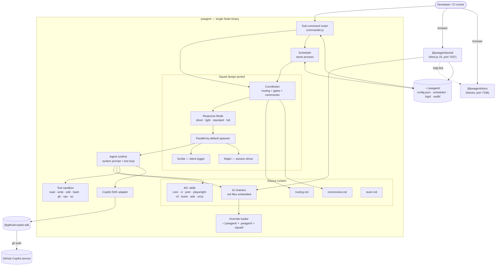

import { Cards, Card } from '../../components/Cards';
import { Layers, Network, Workflow, Cpu, GitBranch, Shield, Activity, Settings } from 'lucide-react';

# Architecture

pwagent is **Squad's design with our runtime**. The eleven Squad benefits port into the binary as first-class modules or filesystem conventions — same charter format, same routing.md / ceremonies.md / team.md files, but no upstream `squad.agent.md` coordinator manifest at run time. The coordinator logic is a TypeScript module inside the binary.

## At a glance

## Hard rules

- **Squad design, our runtime.** Adopt the eleven Squad benefits verbatim as filesystem conventions and runtime behaviours. Do **not** load the upstream Squad coordinator manifest at run time.
- **Embedded by default.** All 10 charters and 60+ skill guides ship inside the binary. Works zero-config in any directory.
- **Workspace overrides win.** If `cwd/.pwagent/agents/triage/charter.md` exists, it overrides the embedded triage charter. Source-controlled customisation without forking the binary.
- **Scheduler is a sub-command**, not a separate daemon. Same logs, same config, same process.
- **Three independent layers.** CLI, portal, and scheduler each function alone; removing any one leaves the others working.

## Read more

<Cards cols={2}>
  <Card icon={<Layers />} title="Three Layers" href="/architecture/layers">
    CLI / portal / scheduler — what each does, what isolation looks like
  </Card>
  <Card icon={<GitBranch />} title="Override Chain" href="/architecture/override-chain">
    How charter and skill resolution walks the four-step priority chain
  </Card>
  <Card icon={<Workflow />} title="Coordinator Runtime" href="/architecture/coordinator">
    What `pwagent run` actually does — charter loading, model selection, tool filtering
  </Card>
  <Card icon={<Cpu />} title="Response Modes" href="/architecture/response-modes">
    Direct / Lightweight / Standard / Full — when each mode is chosen
  </Card>
  <Card icon={<Shield />} title="Tool Sandbox" href="/architecture/tool-sandbox">
    Binary allowlist, output caps, timeouts, the read/write/edit/bash/grep contract
  </Card>
  <Card icon={<Activity />} title="Sequence Diagrams" href="/architecture/sequence-diagrams">
    Bootstrap, agent invocation, scheduler tick, portal SSR — Mermaid flows
  </Card>
  <Card icon={<Settings />} title="Invariants" href="/architecture/invariants">
    Hard rules the runtime enforces and what happens when they're violated
  </Card>
</Cards>
