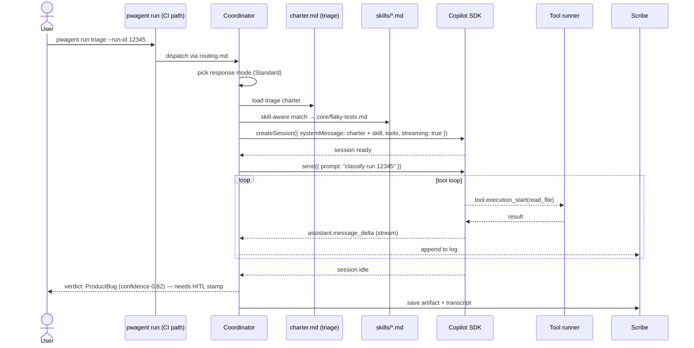
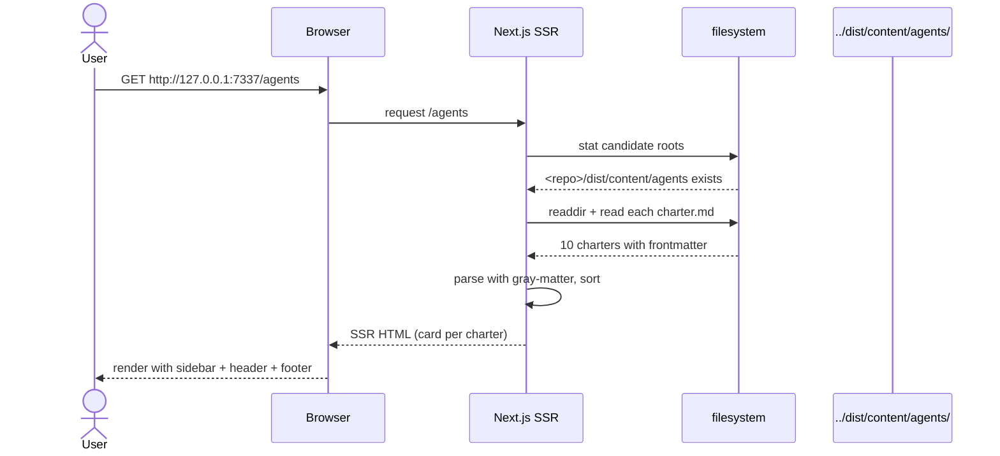
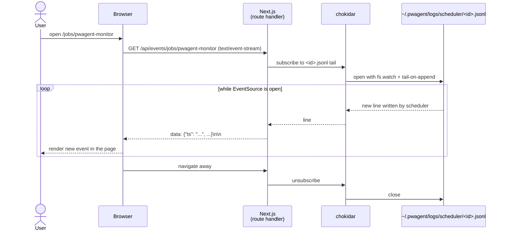
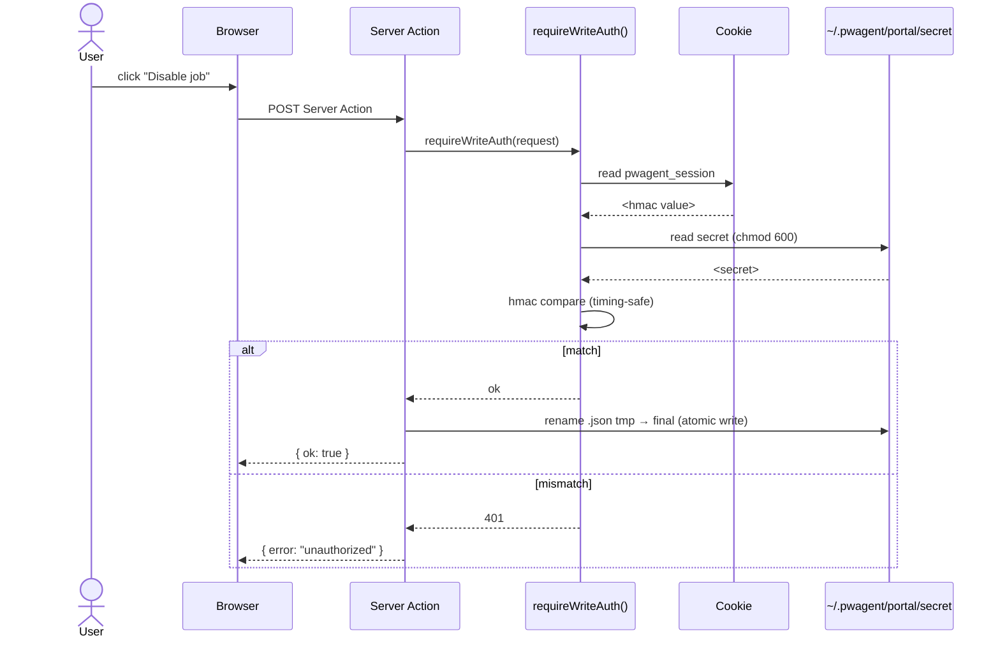

# Sequence Diagrams

End-to-end flows for the core paths. Two daily-driver shapes: **chat** (`pwagent` no args → Squad → Copilot CLI) and **CI** (`pwagent run <agent>` → coordinator → SDK).

## Chat launch — `pwagent` opens GitHub Copilot CLI

```mermaid
sequenceDiagram
    actor User
    participant Term as Terminal
    participant Bin as pwagent binary
    participant FS as filesystem
    participant Squad as @bradygaster/squad-cli (npx)
    participant Copilot as GitHub Copilot CLI

    User->>Term: pwagent
    Term->>Bin: argv = ["pwagent"]; stdin.isTTY = true

    Bin->>Bin: route to squad-host.ts

    Bin->>FS: exists(.pwagent/)?
    alt missing — first run
        Bin->>FS: cp embedded/{agents,skills,routing.md,...} → .pwagent/
        Bin-->>Term: "scaffolded .pwagent/"
    end

    Bin->>FS: rm -rf .squad/
    Bin->>FS: cp .pwagent/ → .squad/   (mirror)
    Bin-->>Term: "launching GitHub Copilot CLI via Squad…"

    Bin->>Squad: spawn npx @bradygaster/squad-cli (stdio inherit)
    Squad->>FS: detect .squad/  →  found
    Squad->>FS: read .squad/agents/, skills/, routing.md, team.md
    Squad->>Copilot: launch with squad.agent.md coordinator + roster
    Copilot-->>User: banner, slash-menu, › prompt

    Note over User,Copilot: User chats interactively.<br/>Slash commands like /fix --orchestrate ...<br/>route to specialists via Squad's coordinator.

    User->>Copilot: /quit
    Copilot-->>Squad: exit 0
    Squad-->>Bin: exit 0
    Bin->>Term: process.exit(0)
```

## Bootstrap — first-time setup on a new machine

```mermaid
sequenceDiagram
    actor User
    participant Term as Terminal
    participant Bin as pwagent binary
    participant Gh as gh CLI
    participant SDK as @github/copilot-sdk

    User->>Term: pwagent prereqs --install
    Term->>Bin: detect each prereq
    Bin-->>Term: report (node ✓, git ✓, gh ✗, gh-auth ✗, ...)
    Bin->>Term: prompt: install gh via winget? [Y/n]
    User->>Term: y
    Bin->>Term: winget install GitHub.cli
    Term-->>Bin: ok

    User->>Term: pwagent login
    Bin->>Gh: gh auth login --web --scopes read:user
    Gh-->>User: open browser
    User->>Gh: complete OAuth
    Gh-->>Bin: token stored in gh keychain

    User->>Term: pwagent init
    Bin->>User: prompt model + ADO org/project
    User-->>Bin: claude-sonnet-4.5, contoso, Engineering
    Bin->>Bin: write ~/.pwagent/config.json (atomic)

    User->>Term: pwagent doctor
    Bin->>SDK: import; resolve auth via gh
    SDK-->>Bin: reachable
    Bin-->>User: Ready. (features matrix)
```

## Agent invocation (CI / unattended) — `pwagent run triage`

The interactive path goes through Copilot CLI (see [Chat launch](#chat-launch--pwagent-opens-github-copilot-cli) above). The `pwagent run` command is for **CI / scheduled / scripted** invocations — no Copilot CLI dependency on the runner; uses `@github/copilot-sdk` directly.



## Scheduler tick

```mermaid
sequenceDiagram
    participant Loop as pwagent scheduler<br/>(in-process)
    participant Store as state.json
    participant Lock as <id>.lock
    participant Disp as Dispatcher
    participant CLI as pwagent (same binary)
    participant Events as <id>.jsonl

    loop every 1s
        Loop->>Store: which jobs are due?
        alt one or more due
            Loop->>Lock: acquire <pwagent-monitor>.lock
            Loop->>Events: agent_start
            Loop->>Disp: spawn pwagent monitor --once
            Disp->>CLI: child_process.spawn
            CLI-->>Disp: exit code + stdout
            alt success
                Disp->>Events: agent_end (ok)
                Loop->>Store: update lastRunAt + nextDueAt
            else failure
                Disp->>Events: agent_error
                Loop->>Store: ++consecutiveFailures
                alt failures >= disableAfter
                    Loop->>Store: set enabled=false
                end
            end
            Loop->>Lock: release
        end
    end
```

## Portal — browsing agents at `/agents`



## Portal — live event tail (SSE)



## Bearer-auth Server Action (v0.4)


