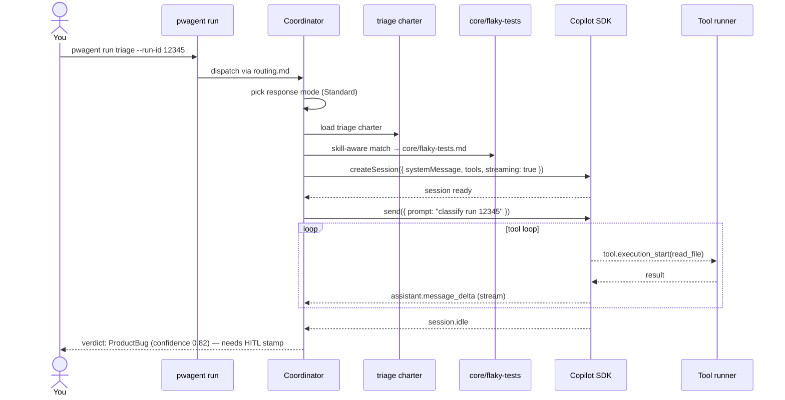

# Your First Run

Now that the binary is installed, prereqs are green, and `gh auth` is configured, let's invoke an agent end-to-end.

## Pick a real or example failure

If you have an ADO build with a Playwright failure, grab its run id. Otherwise, use the canned example fixture shipped with the CLI:

```powershell
pwagent run triage --example
```

That feeds `cli/src/content/examples/failure-fixture.json` into the triage agent and exercises the full path without needing live ADO access.

## What happens, step by step



Sequence (verbatim from the README): coordinator picks mode, loads charter + skills, calls SDK, runs tool loop, returns a verdict.

## What you'll see in the terminal

```
[pwagent] run triage --run-id 12345
[pwagent] mode: standard
[pwagent] charter: triage (embedded)
[pwagent] skill-aware injection: core/flaky-tests, core/locators
[pwagent] copilot session: opened (claude-sonnet-4.5)

🔍 Reading run 12345 artifacts...
   read  cli/tests/example/failure-fixture.json
   read  cli/tests/example/trace.zip.manifest

📊 Analysis:
   - Last 3 runs of this test: 1 pass, 2 fails
   - Failure on click("button.submit") after 30s wait
   - Console: "form validation: missing customer_id"
   - Network: POST /api/orders returned 400 (Bad Request)

Verdict: ProductBug
Confidence: 0.82
Rationale: Server returned a 400 for a payload the test claims is valid.
           Likely a real product regression in the order validation path.

Next: needs HITL stamp. Run:  pwagent review
```

Stop here. Don't run `pwagent run heal` yet — by Squad's reviewer-gate convention, heal won't spawn until you stamp the triage verdict.

## Stamp it

```powershell
pwagent review
```

You'll see a queue of unsigned verdicts. Press `[p]` to accept this triage as a ProductBug, `[t]` to override to TestCodeBug, `[s]` to skip, `[o]` to mark Inconclusive. The stamped verdict is appended to `~/.pwagent/audit/events.jsonl`.

## Now patch

With a stamped triage in hand:

```powershell
pwagent run heal --from-triage 12345
```

heal will:

1. Load the stamped triage verdict (refuses to start without one)
2. Read the failure trace and offending source files
3. Propose a patch (shown as a unified diff in the terminal)
4. Ask you to confirm before writing
5. Run `npx playwright test` locally to validate the fix
6. Open an ADO or GitHub PR

## Where to go next

- **Watch it in the portal.** `pwagent portal start` — go to `/audit` to see your run+stamp events, `/jobs` to see the scheduler (if running).
- **Tour every agent.** [Agents](/agents) has one page per specialist with identity, responsibilities, boundaries, tools, model.
- **Wire up the scheduler.** [Scheduler](/scheduler) explains the four seed jobs, how to enable them, and the platform-service installer.
