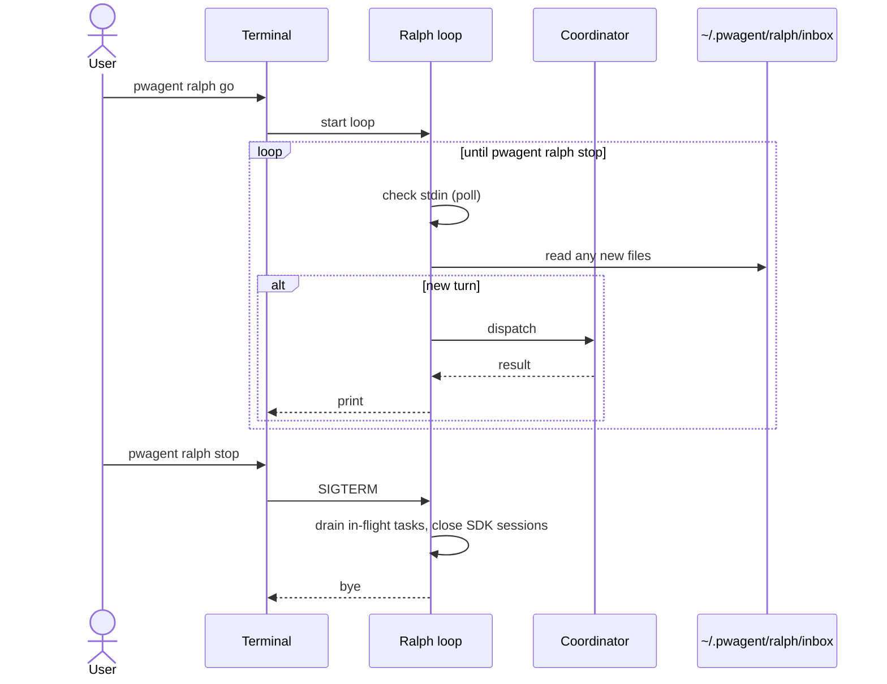

# Ralph — In-session Driver

**Ralph** is Squad's name for the in-session loop that keeps the supervisor active. Where the [scheduler](/scheduler) wakes up on a tick, Ralph stays awake until you stop it.

## When to use which

| Need | Use |
|---|---|
| "Check ADO for new failures every 5 minutes" | **Scheduler** (`pwagent-monitor`) |
| "Stay attached and keep handling whatever I throw at you" | **Ralph** |
| "Wake at 2 AM and run the coverage sweep" | **Scheduler** |
| "Run a 30-minute hands-off triage marathon now" | **Ralph** |

## Running it

```powershell
pwagent ralph go            # start; foreground
pwagent ralph go --daemon   # detach (POSIX)
pwagent ralph status        # is it running?
pwagent ralph stop          # gracefully stop
```

While Ralph is running, the supervisor processes its inbox (new triage queue entries, scheduled tasks, free-text prompts piped in) until you stop it.

## The inbox

Ralph reads:

1. **Stdin** — piped lines treated as user turns
2. **`~/.pwagent/ralph/inbox/*.txt`** — files dropped here are processed one at a time
3. **The HITL queue** — newly added entries trigger a "you have stamps waiting" notice
4. **The scheduler events stream** — failed jobs surface a "scheduler job X failed" notice

You can wire up an editor / Slack bridge to drop files into `~/.pwagent/ralph/inbox/` to feed Ralph.

## Lifecycle



## Why a separate concept

The scheduler is **declarative** — you write a JSON spec and it runs on cadence. Ralph is **imperative** — you start it, drop work into it, stop it. Some workflows fit the first, some fit the second. Ralph is also useful for **interactive marathons** like:

- "I'm going to spend 30 minutes triaging the morning failures, keep up"
- "I'll be piping these PR review comments at you, give me an opinion on each"

The scheduler is wrong for those because each turn is novel.

## Source

[`cli/src/cli/ralph.ts`](https://github.com/microsoft/pwagent/blob/main/cli/src/cli/ralph.ts)
