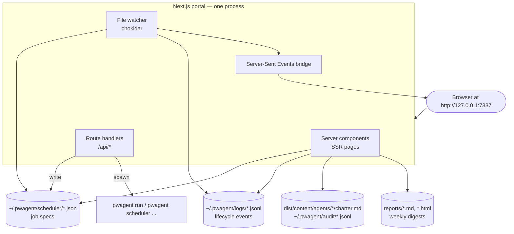

# Portal

The portal is a separate Next.js 15 process at `http://127.0.0.1:7337`. It is **independent of the CLI** — kill the portal and the CLI + scheduler keep working; kill the scheduler and the portal still shows historical state.

## Goals

| Goal | Why |
|---|---|
| Single URL to see everything pwagent is doing | Operators want one place to look |
| Live log tail (per job, per agent) | Debugging unattended runs |
| Edit scheduler configs through a form (not JSON) | Lower barrier for non-engineers |
| Trigger one-off runs from a button | Faster than shelling out |
| Render reports (Markdown + HTML) inline | The weekly report is the audience-facing artifact |
| Audit-log viewer with filters | Compliance, "what ran last Tuesday" |
| Help link to the docs (this site) | New users can find the manual without leaving the UI |

## Non-goals

| Non-goal | Why not |
|---|---|
| Hosted multi-tenant SaaS | Local-only by design |
| Replace the CLI for power users | The CLI is faster for scripted work |
| Multi-user accounts / RBAC | One user per machine; auth only as a loopback guard |
| Live edit charters | Charters are source-controlled; UI is read-only for those |

## Architecture



## Stack

- **Next.js 15 App Router** — file-based routing, server components, streaming.
- **Tailwind CSS** + **shadcn/ui** — hand-written components in `portal/components/ui/`.
- **Server Actions** for form writes (enable/disable jobs, edit config).
- **Server-Sent Events** for live tails (not WebSocket — simpler, fine for one-way streaming).
- **No database.** All state is files on disk. SSR reads them on each request; SSE pushes deltas.

## Port

Fixed default: **`http://127.0.0.1:7337`**. Memorable (`7337` ≈ "leet"), outside common dev ports (3000/3001/8080), bound to `127.0.0.1` only.

```bash
pwagent portal start                         # http://127.0.0.1:7337
pwagent portal start --port 3737             # alternative
PWAGENT_PORTAL_PORT=9999 pwagent portal start
```

The docs site (this one) runs on **`7338`** — adjacent and memorable.

## Why a separate portal

The CLI gives you imperative control. It is great for *doing* one thing. It is bad for *seeing*:

- Tailing five jobs at once
- Skimming yesterday's weekly report
- Editing schedules without hand-rolling JSON
- Cross-referencing a failed run to its triage verdict and the eventual PR

## Read more

- [Routes](/portal/routes) — full route table with what each page does
- [Server Actions](/portal/server-actions) — write-side endpoints, auth contract
- [Server-Sent Events](/portal/sse) — live event tail wiring
- [Auth & Safety](/portal/auth) — bearer secret, HttpOnly cookie, loopback enforcement
- [Read-only Mode](/portal/read-only) — `--read-only` flag and what it disables
- [Help / Docs Link](/portal/help) — how the portal links to these docs
