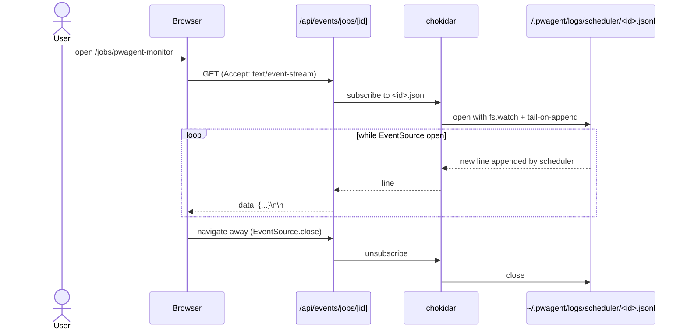

# Server-Sent Events

The portal streams live updates to the browser via SSE — not WebSocket. SSE is one-way (server → client), text-only, and natively supported by every browser. Simpler than WebSocket, and one-way is all we need.

## Where SSE is used

| Page | Stream source |
|---|---|
| `/jobs/[id]` | `~/.pwagent/logs/scheduler/<id>.jsonl` — tail of lifecycle events |
| `/audit` (live filter) | `~/.pwagent/audit/events.jsonl` — tail of audit events |
| `/runs` | filtered audit tail |

## The wiring



## Server side

```ts
// portal/app/api/events/jobs/[id]/route.ts
export async function GET(req: Request, { params }: { params: { id: string } }) {
  const { id } = params;
  const path = jobEventsPath(id);

  const stream = new ReadableStream({
    start(controller) {
      const encoder = new TextEncoder();
      const watcher = tailJsonl(path, (line) => {
        controller.enqueue(encoder.encode(`data: ${line}\n\n`));
      });

      req.signal.addEventListener('abort', () => {
        watcher.close();
        controller.close();
      });
    },
  });

  return new Response(stream, {
    headers: {
      'Content-Type': 'text/event-stream',
      'Cache-Control': 'no-cache, no-transform',
      'X-Accel-Buffering': 'no',
    },
  });
}
```

## Client side

```tsx
// portal/app/jobs/[id]/EventTail.tsx — client component
'use client';
import { useEffect, useState } from 'react';

export function EventTail({ id }: { id: string }) {
  const [events, setEvents] = useState<any[]>([]);

  useEffect(() => {
    const es = new EventSource(`/api/events/jobs/${id}`);
    es.onmessage = (msg) => {
      setEvents((prev) => [...prev, JSON.parse(msg.data)]);
    };
    return () => es.close();
  }, [id]);

  return (
    <ul>
      {events.map((e, i) => (
        <li key={i}>{e.ts} — {e.type}</li>
      ))}
    </ul>
  );
}
```

## Why not WebSocket

| Concern | SSE | WebSocket |
|---|---|---|
| Direction | server → client only | bidirectional |
| Protocol | plain HTTP | upgrade handshake |
| Browser support | native `EventSource` | native `WebSocket` |
| Reconnection | auto-reconnect with `Last-Event-ID` | manual |
| Compatibility with HTTP/2 | yes | yes |
| Proxy / firewall friendliness | high (looks like a long-poll) | medium |
| Code complexity (this use case) | ~30 lines | ~80 lines |

We don't need bidirectional. Every write goes through Server Actions, which is a separate channel.

## Caveats

- **Connection limit per origin.** Chrome caps HTTP/1.1 connections at 6 per origin. SSE counts. Avoid opening 6 tabs of `/jobs/<id>`.
- **No compression.** Don't put binary data in events. Stick to short JSON lines.
- **Keep-alive heartbeats.** The handler emits `:\n\n` every 30 s so proxies don't close idle connections.
- **Server reconnect.** If the portal restarts mid-stream, the browser reconnects automatically and resumes from `Last-Event-ID` if the handler honors it (it does for `/api/events/jobs/<id>`).
